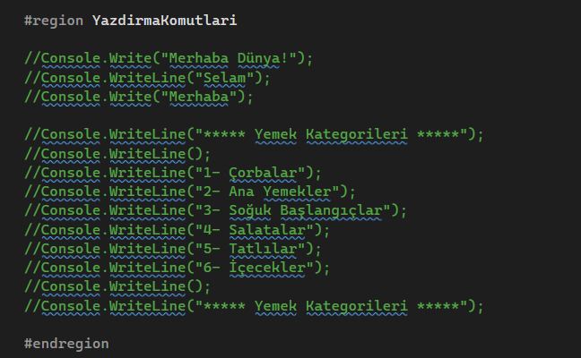
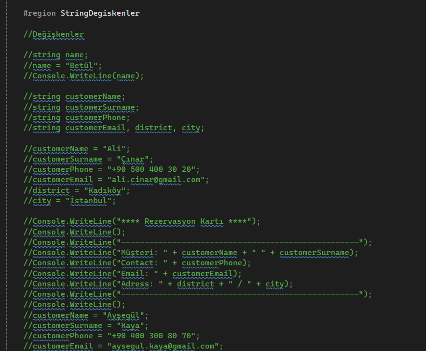
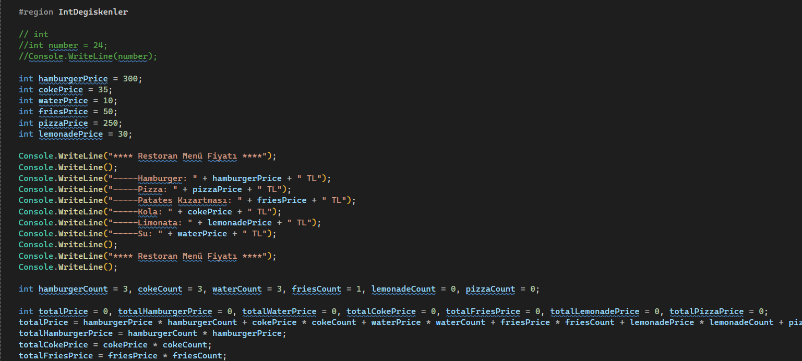

# CSharpEgitimKampi

<h2>Ders: 01_MainSubjects</h2>
<h3>Öğrendiklerim:</h3>
<ul>
<li>Console.WriteLine(); / Console.Write(); -- Yazdırma Komutları</li>
<li>string name; -- String Değişkenler</li>
<li>int number; -- int Değişkenler </li>
</ul>

   

   

   

   
 

<h2> Ders: 02_Variables </h2>

