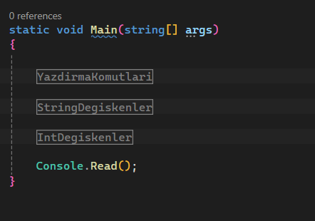

# CSharpEgitimKampi

<h2>Proje: 1 </h2>
<h4>Öğrendiklerim:</h4>
<ul>
<li>Console.WriteLine(); / Console.Write(); -- Yazdırma Komutları</li>
<li>string name; -- String Değişkenler</li>
<li>int number; -- int Değişkenler </li>
</ul>

